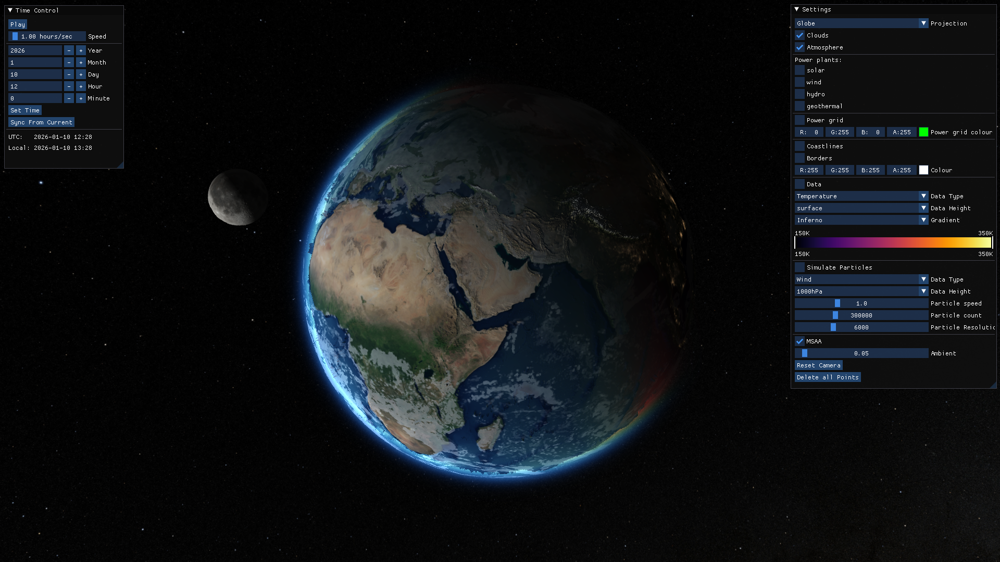
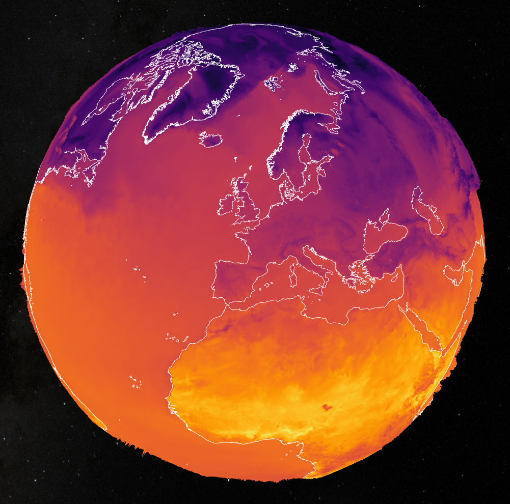
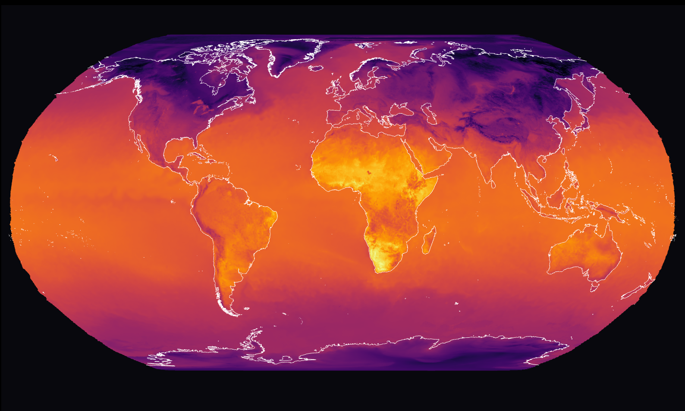
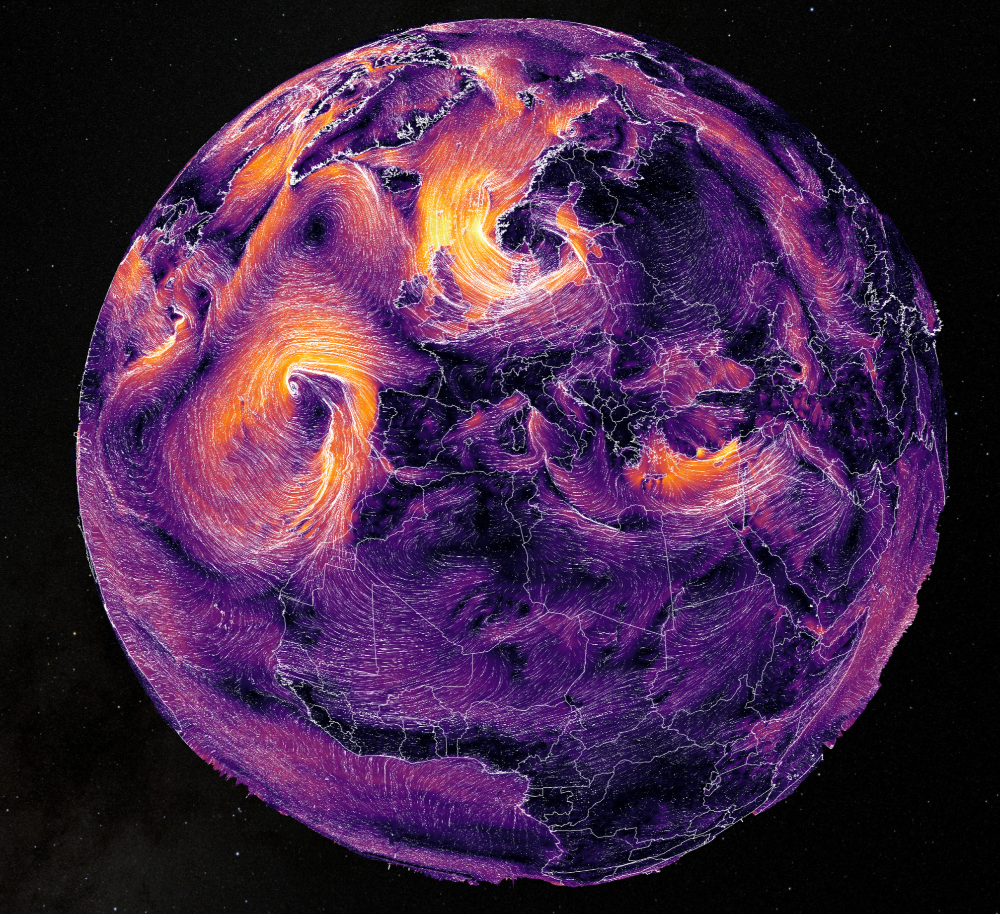
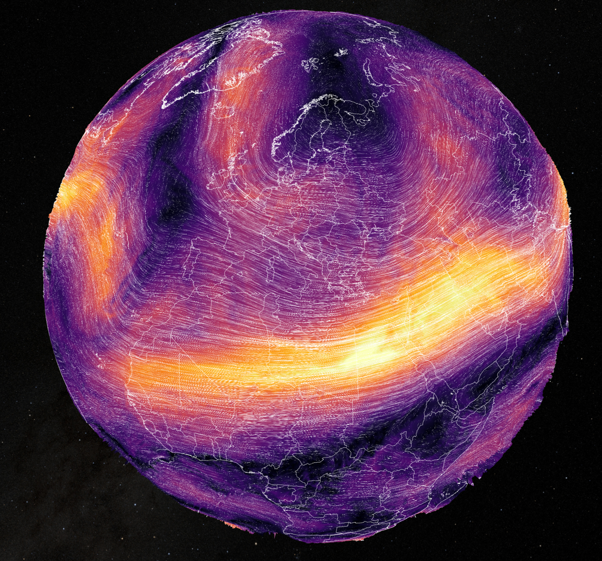
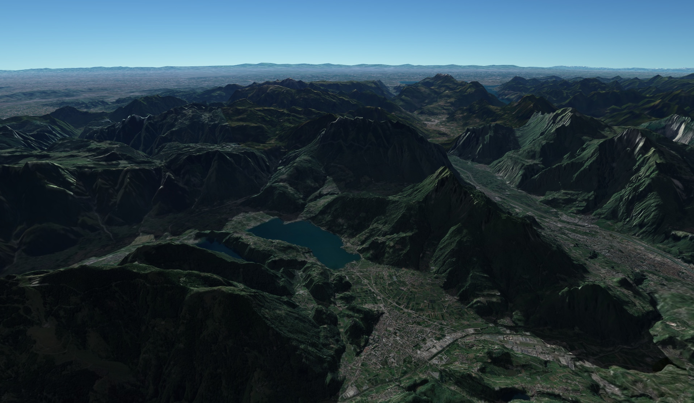
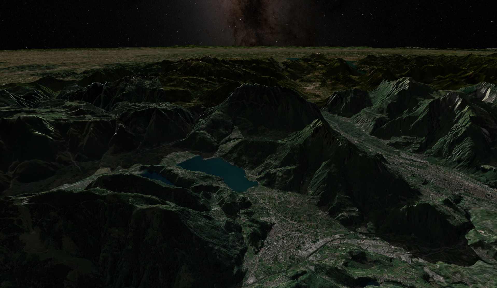
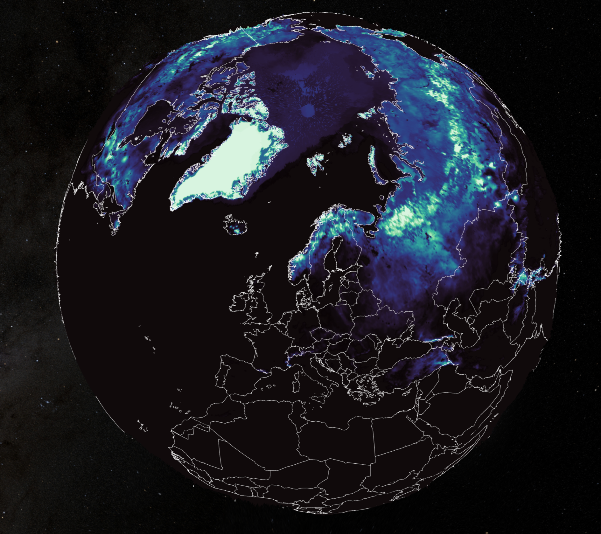
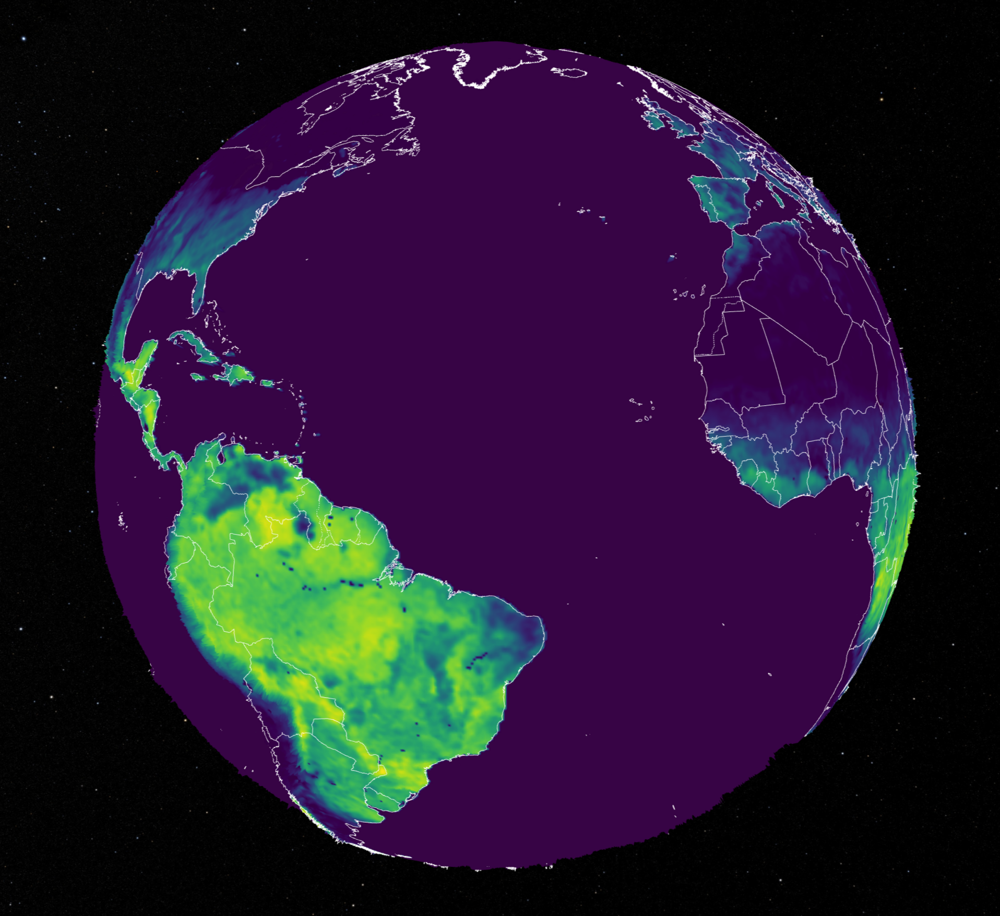
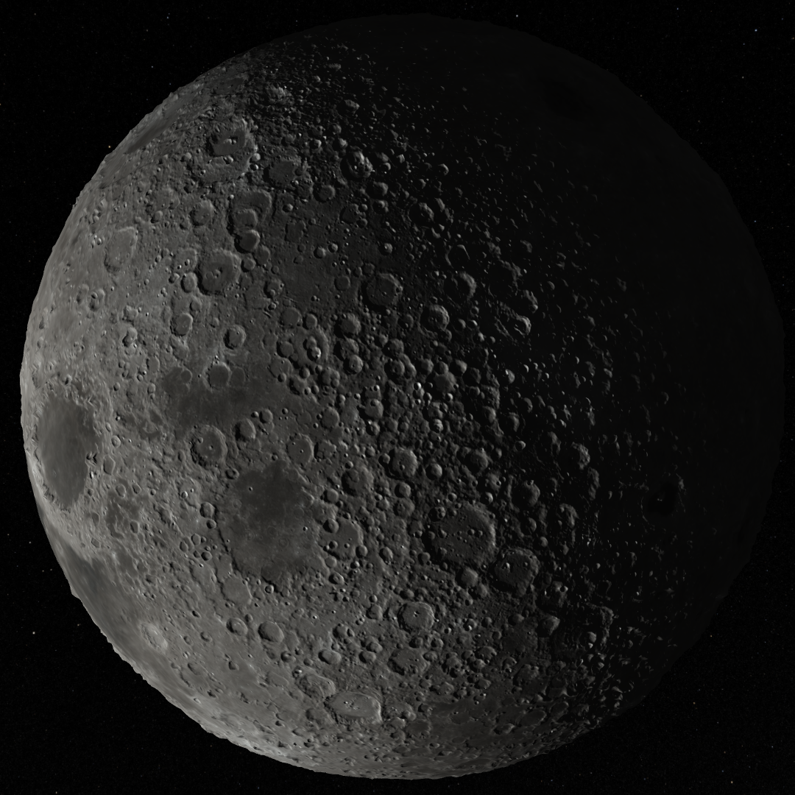

# EcoVis

An interactive OpenGL-based visualization and analysis tool for weather and energy production data. The application allows users to explore temporal weather datasets, energy infrastructure, and power generation data on both a 3D globe and multiple flat map projections and variable grid resolutions.

## Attributions
#### Core Developers
- Max Bennedik
- Moritz Dietrich
#### Tech Lead/Supervisor
- Jan Schneegans

## Requirements

All Python dependencies can be found in [`pyproject.toml`](pyproject.toml).  
The project is written in Python 3.12. Other Python versions may cause issues.

### Supported Operating Systems

* Windows
* Linux

## Features

### Interactive Earth Visualization

Visualize weather and energy-related datasets on either:

* A fully interactive 3D globe
* Multiple planar map projections

All displayed data is projected onto the selected Earth representation.

### Weather Data Visualization

Weather datasets can be displayed in two different ways:

* **Surface coloring** of the map using scalar weather values
* **Particle simulations** for vector-based weather data

Users can:

* Select the weather dataset to display
* Choose custom color gradients and configure their value ranges

### Energy Infrastructure Visualization

The application supports the visualization of energy infrastructure through:

* 3D power plant models placed on the Earth's surface
* Power grid visualization with customizable colors
* Time-dependent power generation data

Selecting a power plant opens a production graph showing its electricity generation over time.

### Atmospheric Effects

Additional visual enhancements include:

* Dynamic cloud layers generated from weather data
* Atmospheric rendering effects
* Coastline visualization
* Country border visualization

## User Interface

Since both weather conditions and energy production are time-dependent, the application includes a time control panel that allows users to:

* Select a specific date and time
* Continuously advance time through the dataset
* Explore historical or forecast data interactively

The configuration panel on the right side provides access to:

* Earth projection selection (globe or planar projections)
* Cloud layer and atmospheric effects
* Power plant visibility settings
* Power grid visibility and color configuration
* Coastline and country border visibility and color configuration
* Weather data surface rendering options
* Particle simulation settings for vector datasets

Camera navigation is possible using either mouse or keyboard controls

Users can interact directly with the map:

* Click anywhere on the map to create a measurement point
* Inspect precise weather data values at that location
* Click the measurement point again to remove it

## Documentation

Additional information about:

* Project configuration
* Loading and visualizing custom datasets
* Data formats and requirements

can be found in the [project documentation](documentation/table_of_contents.md).

## Getting Started

1. Clone the repository.
2. Install the required dependencies listed in [`pyproject.toml`](pyproject.toml).
3. Optionally configure the application according to your data sources.
4. Launch the application.
5. Explore weather and energy data interactively on a 3D globe or map projection.

## Sources

Sources for all data and resources used for the project can be found [here](documentation/sources.md).

[//]: # (TODO: Specify project's license)

## Screenshots

