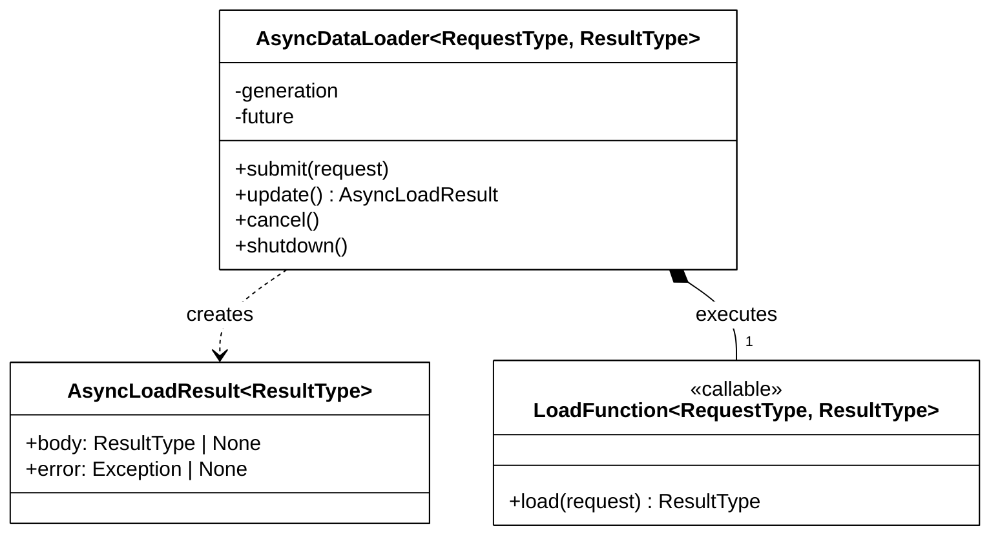
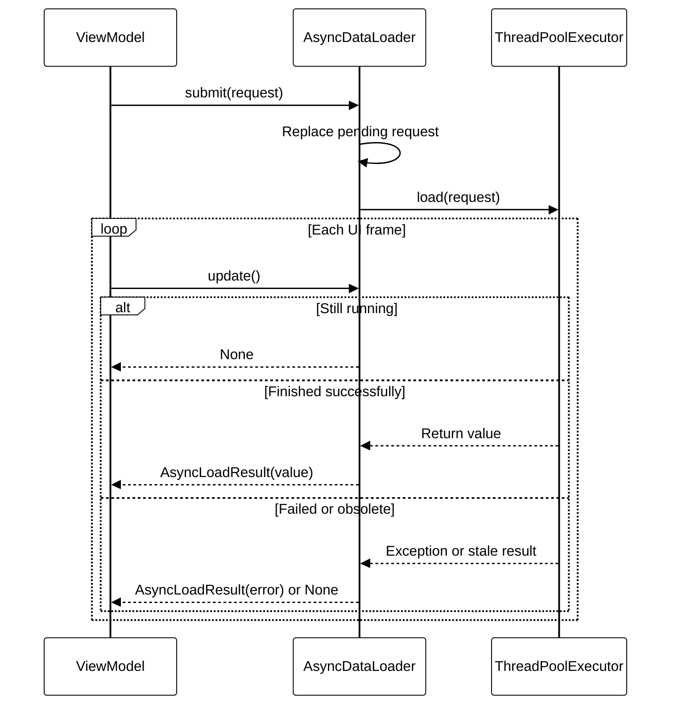

# Asynchronous Data Loading

Weather and power data are loaded asynchronously using the `DataStreamer` abstraction. This allows large datasets to be prepared in the background while the application remains responsive and rendering continues uninterrupted.

## Overview

Whenever the currently selected timestamp changes, the data streamer maintains a small loading pipeline:

1. Load data for the current timestamp.
2. Preload data for the next timestamp.

By always keeping the next timestep prepared in advance, sequential playback can switch datasets immediately without waiting for disk access, network or data processing.

## AsyncDataLoader

View models use `AsyncDataLoader` for single, replaceable background tasks such
as graph generation, windrose image creation and user-script execution. The
view model submits a request and polls the loader once per UI frame. A new
request supersedes the previous one; an older task may still finish if it was
already running, but its result is ignored by the generation check.

### Class overview

### Request lifecycle

`submit()` assigns every request a monotonically increasing generation. The
loader stores only the current `Future`; therefore `update()` reports at most
one result to the view model. `AsyncLoadResult` transports either the loaded
value or the exception, while cancellation and obsolete generations remain
silent. `shutdown()` is called when the owning view model is destroyed.

## Streaming Pipeline

The base `DataStreamer` class manages a background `ThreadPoolExecutor` and keeps track of three states:

- **Pending** – data currently being loaded by worker threads.
- **Ready** – finished datasets waiting to be applied.
- **Active** – data currently used by the application.

During each update cycle, completed loading tasks are moved from the pending state to the ready state. Once the corresponding timestamp becomes active, the prepared result is applied immediately.

## Sequential Playback Optimisation

The streamer is optimized for normal forward playback.

For example, when displaying data for time *T*:

- Data for *T* is loaded.
- Data for *T + 1* is preloaded.

When playback advances to the next timestep, the data is usually already available and can be applied without any noticeable delay.

## Invalidation and Time Jumps

Users may jump to arbitrary timestamps rather than progressing sequentially.

In such cases, previously scheduled loading operations become irrelevant. The streamer therefore invalidates all pending work:

- Running tasks are cancelled where possible.
- Previously loaded but unused results are discarded.
- A new generation identifier is created.

Each loading task stores the generation in which it was created. If an outdated task finishes after an invalidation, its result is ignored automatically.

This mechanism prevents race conditions and ensures that obsolete data can never overwrite newer results.

## Weather Data Streaming

`WeatherDataStreamer` is a concrete implementation of `DataStreamer`.

It loads:

- Scalar weather fields (e.g. temperature)
- Vector weather fields (e.g. wind)
- Cloud coverage data

Loaded datasets are converted into NumPy arrays and then uploaded directly into existing GPU textures using the `Texture.update_data()` mechanism. This avoids recreating textures and allows weather visualizations to update efficiently whenever the selected time changes.

The streamer also reacts to changes in selected weather variables. When the user selects a different scalar or vector dataset, all pending loads are invalidated and a new loading pipeline is started for the newly requested data.

## Benefits

This architecture provides several advantages:

- Non-blocking data loading
- Smooth timeline playback
- Automatic preloading of future timesteps
- Safe handling of arbitrary time jumps
- Efficient GPU texture updates
- Reusable streaming logic for both weather and power datasets

By separating asynchronous loading from rendering, large scientific datasets can be visualized interactively without introducing frame drops or long pauses during navigation through time.
