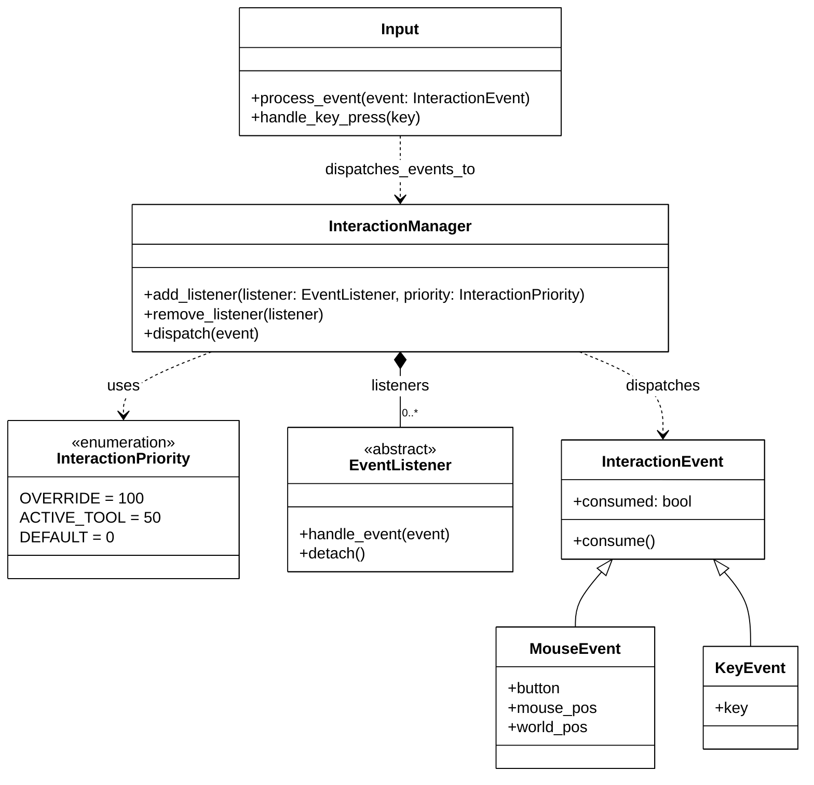
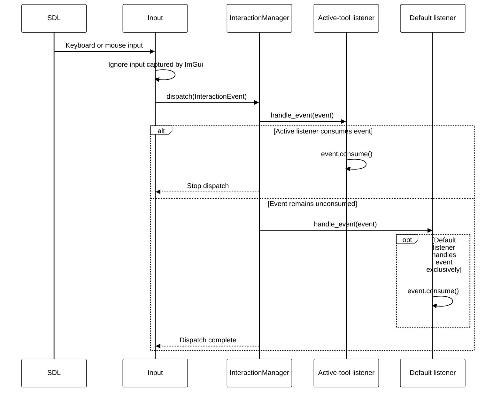

# Event listener architecture

The interaction system decouples raw SDL input from application-specific
actions. `Input` converts relevant keyboard and mouse input into small event
objects and passes them to a central `InteractionManager`. The manager then
offers each event to registered listeners in descending priority order.

## Class structure

`EventListener` defines the common callback contract and provides `detach()`
for unregistering a listener. `InteractionManager` stores each listener
together with an `InteractionPriority`. Adding an already registered listener
first removes its previous entry, which prevents duplicate callbacks. The list
is sorted whenever a listener is added, so `dispatch()` can traverse it without
performing additional priority calculations.

`InteractionEvent` contains the shared `consumed` state. `MouseEvent` adds the
clicked button as well as the screen and world positions.
`KeyEvent` contains the
pressed key. More event types can be added without changing the manager or
existing listeners.

## Event dispatch

An active tool uses `InteractionPriority.ACTIVE_TOOL`, while persistent
features use `InteractionPriority.DEFAULT`. For example, the geographic
position selector temporarily registers as an active tool. It therefore sees
a click before the measurement-point view model. If it consumes that click,
the lower-priority listener is not called.

## Listener lifecycle

Persistent listeners register during initialization and call `detach()` from
their `destroy()` method. Temporary tools register only while active. The
geographic position selector follows this lifecycle:

1. `start_selecting()` registers the view model with `ACTIVE_TOOL` priority.
2. `handle_event()` processes the next suitable left-click event.
3. `stop_selecting()` detaches the listener after a selection or cancellation.
4. `destroy()` also stops selection, ensuring that no obsolete listener remains
   registered.

This explicit lifecycle is important because the manager stores references to
its listeners. A destroyed view model that is not detached could continue to
receive events and would also remain reachable through the manager.

## Input filtering

The listener system receives only application input. `Input` checks ImGui's
keyboard and mouse capture flags before creating or dispatching an interaction
event. Mouse events are dispatched only for clicks below the drag threshold;
camera drags remain part of the continuous input state. This prevents actions
on the map while the user interacts with a UI control.
