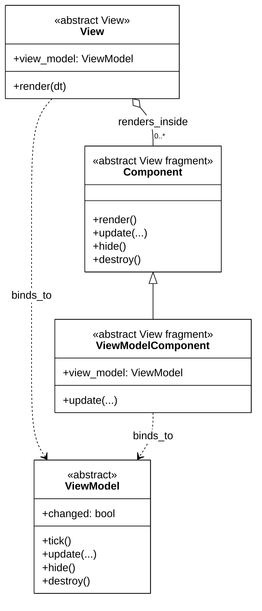
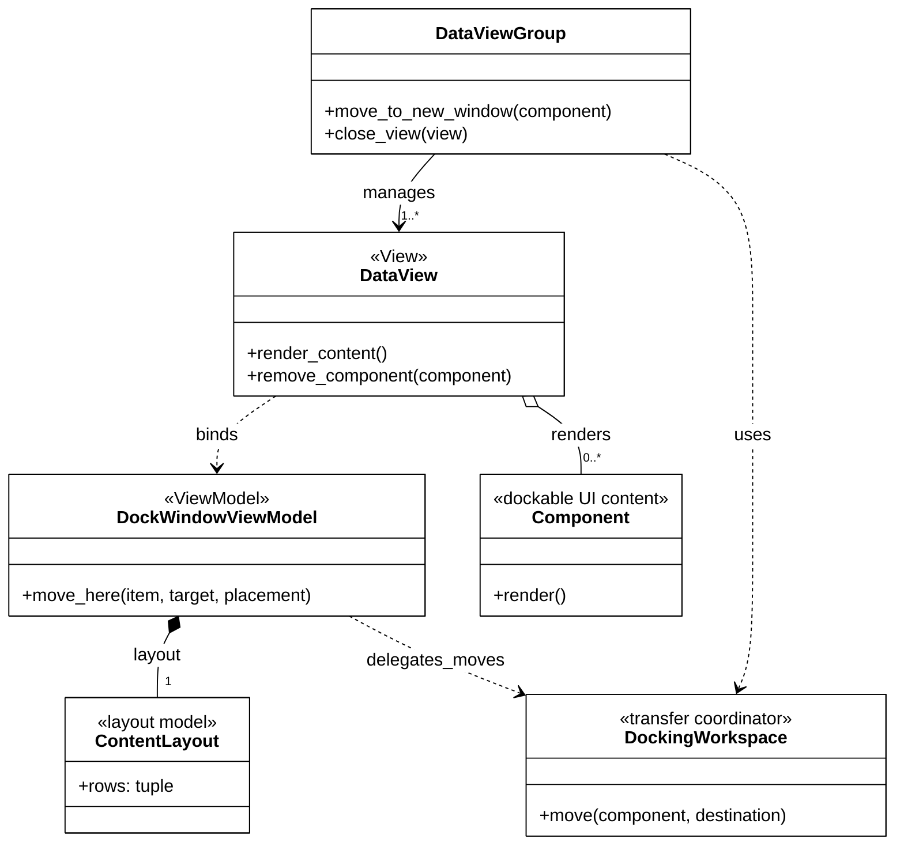
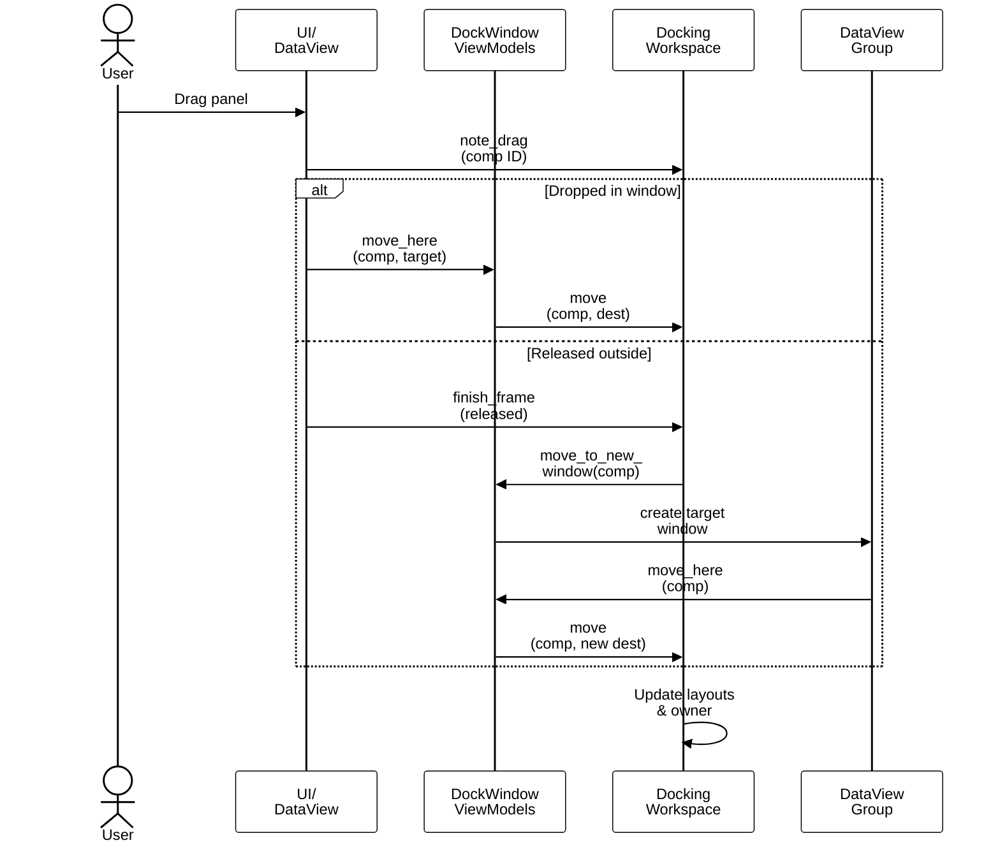

# UI architecture diagrams

The UI uses MVVM at both the window and component level. The first diagram
shows that general structure; the second focuses on how components are hosted
and moved by the docking system. Concrete feature implementations are omitted
to keep both diagrams suitable for a report.

## General MVVM structure

A `View` owns the ImGui presentation. It reads UI state from its `ViewModel`
and translates user input into commands. The view model processes those
commands and accesses domain state or services through the model, but never
depends on the view. Reusable `Component` objects are presentation fragments
rendered inside a view. A stateful `ViewModelComponent` is a `Component` with
its own ViewModel binding and follows the same dependency direction.

## Docking structure

`DataViewGroup` manages the windows. Each `DataView` binds one
`DockWindowViewModel`, which stores its local `ContentLayout`. Cross-window
moves are delegated to `DockingWorkspace`; concrete components remain owned
and rendered by `DataView`. Rendering helpers, base classes, protocols,
validation, and cleanup paths are omitted because they do not change this main
flow.

## Moving a docked component

For a normal drop, the `DataView` sends one `move_here` command to its view
model, which delegates the transfer to the workspace. If the panel is released
outside all windows, the UI frame asks the workspace to finish the drag. The
workspace resolves the source view model, which asks `DataViewGroup` to create
a target window and move the component there. In both cases the workspace
updates the affected layouts and the component owner. Validation, rollback,
cleanup, and empty-window handling are intentionally omitted.
