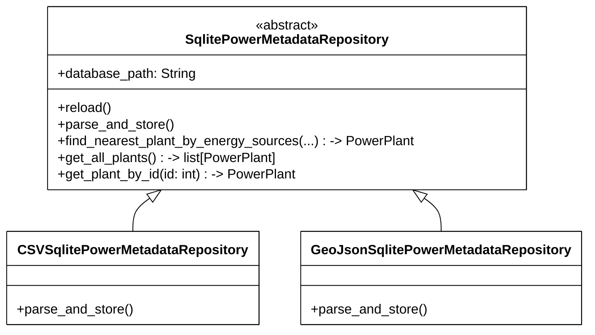

```mermaid
%%{
  init: {
    'theme': 'base',
    'htmlLabels': false,
    'themeVariables': {
      'background': '#ffffff',
      'primaryColor': '#ffffff',
      'primaryBorderColor': '#000000',
      'primaryTextColor': '#000000',
      'lineColor': '#000000',
      'textColor': '#000000',
      'noteBkgColor': '#ffffff',
      'noteBorderColor': '#000000',
      'noteTextColor': '#000000'
    }
  }
}%%
classDiagram
    direction TB

    class SqlitePowerMetadataRepository {
        <<abstract>>
        +database_path: String
        +reload()
        +parse_and_store()*
        +find_nearest_plant_by_energy_sources(...) -> PowerPlant
        +get_all_plants() -> list[PowerPlant]
        +get_plant_by_id(id: int) -> PowerPlant
    }

    class CSVSqlitePowerMetadataRepository {
        +parse_and_store()
    }

    class GeoJsonSqlitePowerMetadataRepository {
        +parse_and_store()
    }

    SqlitePowerMetadataRepository <|-- CSVSqlitePowerMetadataRepository
    SqlitePowerMetadataRepository <|-- GeoJsonSqlitePowerMetadataRepository
```